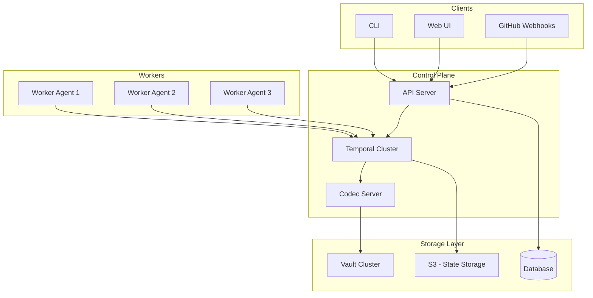
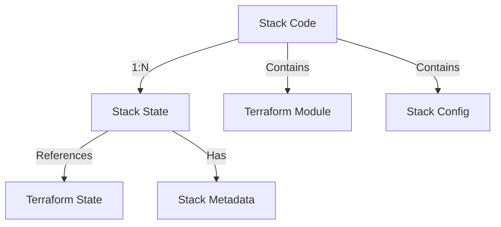
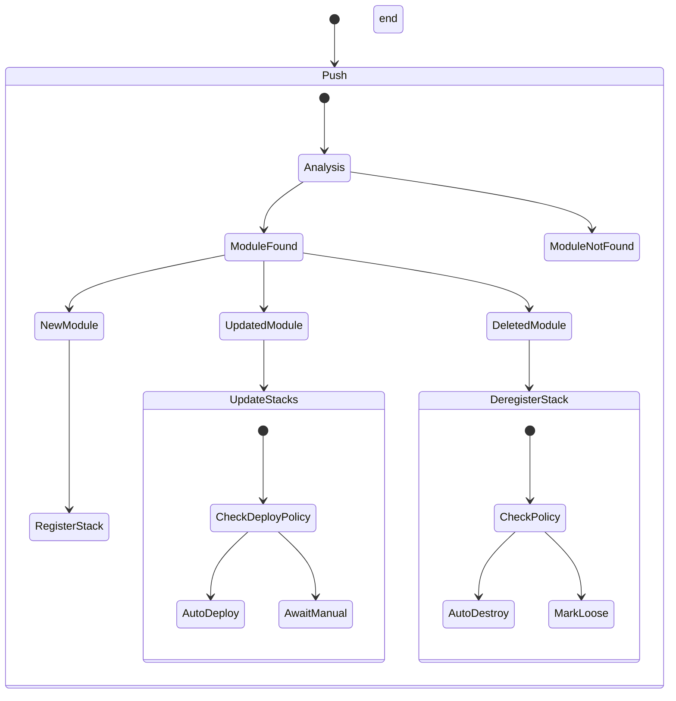
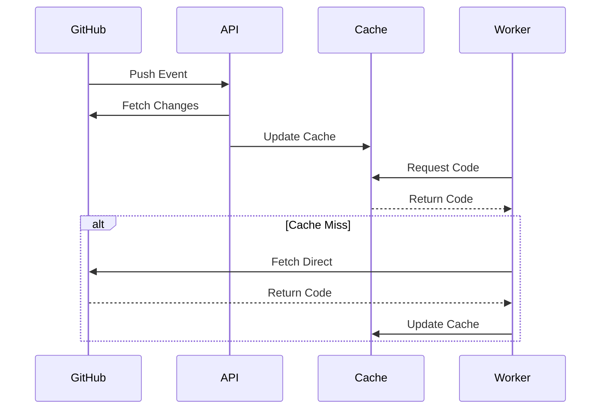
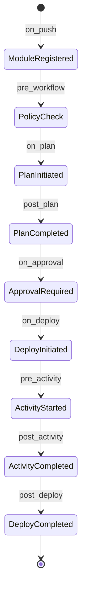
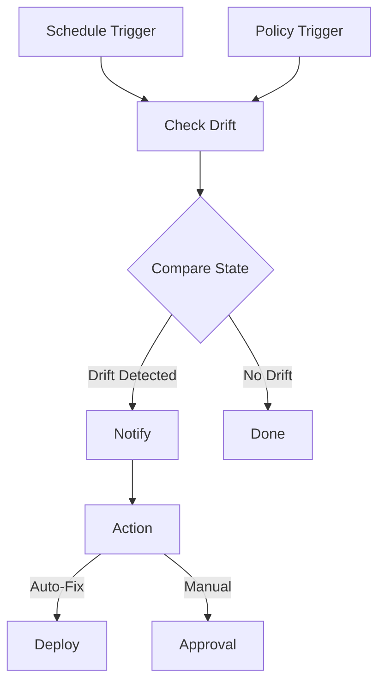
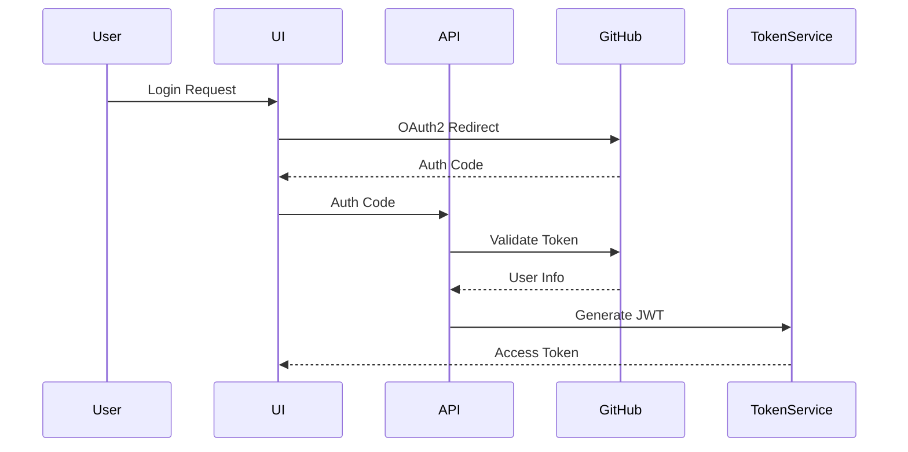
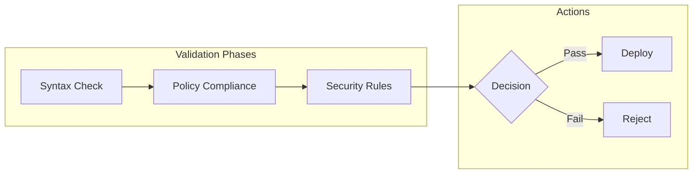

# Stackly System Design

## Architecture Overview

### System Components


## Core Components

### 1. API Server
- **Authentication & Authorization**
  - OAuth2 based SSO (starting with GitHub)
  - Role-based access control (RBAC)
  - JWT for API authentication
  - Rate limiting per account

- **WebHooks**
  ```mermaid
  sequenceDiagram
      participant GitHub
      participant API
      participant DB
      participant Temporal
      
      GitHub->>API: Push Event
      API->>DB: Validate Module
      API->>DB: Register/Update Module
      API->>Temporal: Schedule Workflows
      Note over API,Temporal: Based on stack policies
  ```

- **gRPC Services**
  - Stack management
  - Worker registration
  - Policy enforcement

### 2. Control Plane

#### Temporal Workflow Engine
- **Namespace Management**
  - Per-account default namespace
  - Custom namespace support
  - Resource isolation

- **Worker Management**
```go
type WorkerCapabilities struct {
	Features    []string            // e.g. "terraform", "ansible"
	Labels     map[string]string   // e.g. "environment": "prod"
    Resources  ResourceLimits      // CPU/memory constraints
    Version    string             // Worker version
}
```

#### Codec Server
- Encryption of workflow logs
- Integration with Vault's Transit Engine
- Key version management for log decryption

### 3. Stack Model & Git Integration

#### Core Concepts & Edge Cases


- **Stack Code**
  - Represents a Terraform module with Stackly configuration
  - Can be mapped to multiple Stack States
  - Git-based versioning:
    - Referenced by commit hash
    - Must contain stackly config at root
    - Deletion recognized by:
      - Root module deletion
      - Stackly config removal
  - Edge Cases:
    - Module moved/renamed: Treated as delete + new
    - Config removed: Stack de-registration
    - Git history altered: Potential state mismatch

- **Stack State**
  - Represents a deployed instance of Stack Code
  - Contains:
    - Reference to Stack Code version (commit hash)
    - Terraform state file location
    - Stack metadata (environment, variables, etc.)
    - Deployment history
  - Status Types:
    - Active: Associated with registered stack code
    - Loose: Stack code de-registered but state preserved
  - Operations:
    - Re-associate: Link loose stack to new stack code
    - Manual cleanup: Destroy loose stack
    - Auto-destroy: Based on policy when de-registered

#### Database Schema

```sql
-- Stack Code tracking
CREATE TABLE stack_codes (
    id UUID PRIMARY KEY,
    repo_url TEXT NOT NULL,
    repo_path TEXT NOT NULL,
    current_commit VARCHAR(40) NOT NULL,
    config JSONB NOT NULL,
    status TEXT NOT NULL,
    created_at TIMESTAMPTZ NOT NULL DEFAULT NOW(),
    updated_at TIMESTAMPTZ NOT NULL DEFAULT NOW()
);

-- Stack States
CREATE TABLE stack_states (
    id UUID PRIMARY KEY,
    stack_code_id UUID REFERENCES stack_codes(id),
    commit_hash VARCHAR(40) NOT NULL,
    tf_state_key TEXT NOT NULL,
    variables JSONB NOT NULL,
    metadata JSONB NOT NULL,
    status TEXT NOT NULL,
    created_at TIMESTAMPTZ NOT NULL DEFAULT NOW(),
    updated_at TIMESTAMPTZ NOT NULL DEFAULT NOW()
);

-- Operation History
CREATE TABLE operations (
    id UUID PRIMARY KEY,
    stack_state_id UUID REFERENCES stack_states(id),
    type TEXT NOT NULL,
    status TEXT NOT NULL,
    from_commit VARCHAR(40),
    to_commit VARCHAR(40),
    started_at TIMESTAMPTZ NOT NULL,
    completed_at TIMESTAMPTZ,
    error_details JSONB,
    metadata JSONB
);

-- Git Cache
CREATE TABLE git_cache (
    repo_url TEXT NOT NULL,
    commit_hash VARCHAR(40) NOT NULL,
    path TEXT NOT NULL,
    content BYTEA NOT NULL,
    cached_at TIMESTAMPTZ NOT NULL DEFAULT NOW(),
    PRIMARY KEY (repo_url, commit_hash, path)
);
```

#### Stack Configuration

```hcl
stack "example" {
  version = "1.0.0"
  
  variables {
    environment = "prod"
    region = "us-west-2"
  }
  
  policies = [
    "deployment_window",
    "production_approval"
  ]
  
  hooks {
    pre_plan = ["validate_quotas"]
    post_apply = ["notify_slack"]
  }
}
```
### 4. Git Operations & Events

#### Event Types


#### Git Integration


#### Edge Cases
1. **Git History Changes**
   ```mermaid
   graph TB
       A[History Change Detected]
       B{Affects Active Stacks?}
       C[Continue Normal Operation]
       D[Alert Administrators]
       E[Mark Affected Stacks]
       
       A --> B
       B -->|No| C
       B -->|Yes| D
       D --> E
   ```

2. **Loose Stacks**
   ```mermaid
   graph TB
       A[Stack Becomes Loose]
       B{Auto-Destroy Policy?}
       C[Schedule Destruction]
       D[Mark as Loose]
       E[Await Manual Action]
       F{Valid Association?}
       G[Re-Associate Stack]
       H[Reject Association]
       
       A --> B
       B -->|Yes| C
       B -->|No| D
       D --> E
       E --> F
       F -->|Yes| G
       F -->|No| H
   ```

### 5. Workflow Engines

#### TerraformDSLWorkflow
- **Components**
  ```mermaid
  graph TB
    subgraph "Parser"
        P1[HCL Parser] --> P2[Module Analysis]
        P2 --> P3[Dependency Graph]
    end
    
    subgraph "Scheduler"
        S1[Activity Generator] --> S2[Execution Plan]
        S2 --> S3[Parallel Groups]
        S3 --> S4[Sequential Chains]
    end
    
    subgraph "Activities"
        A1[Plan] --> A2[Apply]
        A2 --> A3[Output Collection]
    end
    
    P3 --> S1
    S4 --> A1
  ```

##### Terraform Parser
- Uses `github.com/hashicorp/terraform-config-inspect`
- Analyzes module structure:
```go
type ModuleStructure struct {
	Variables    map[string]*Variable
	Outputs     map[string]*Output
	ModuleCalls map[string]*ModuleCall
    Dependencies []string
}
```
- Generates dependency graph for activity ordering

##### Terraform Scheduler
- **Activity Definition**
```go
type Activity struct {
	Name string
    Type string         // "module", "resource", etc.
    Path string         // Module path
    DependsOn []string
    Inputs map[string]interface{}
    Outputs []string
    ExecutionMode string // "sequential", "parallel"
}
```

- **Execution Models**
  ```mermaid
  graph TB
    subgraph "Sequential"
        A --> B --> C
    end
    
    subgraph "Parallel"
        D --> E & F & G --> H
    end
    
    subgraph "Branch"
        I --> J & K
        J --> L
        K --> M
        L & M --> N
    end
  ```

- **Activity Generation**
  1. Each module block becomes an activity
  2. Dependencies create activity chains
  3. Independent modules form parallel groups
  4. Variables map to activity inputs
  5. Outputs define activity results

##### Event System


- **Event Types**
```go
type Event struct {
	Type EventType
    Stack Stack
    Payload EventPayload
    Timestamp time.Time
    Context map[string]interface{}
}

type EventType string
const (
	EventModuleRegistered EventType = "module_registered"
    EventPolicyCheck      EventType = "policy_check"
    EventPlanInitiated    EventType = "plan_initiated"
    // ... other events
)
```

- **Hook System**
```go
type Hook struct {
	Event EventType
    Handler func(ctx context.Context, event Event) error
    Priority int
    Timeout time.Duration
}
```

- **Event Processing**
  ```mermaid
  sequenceDiagram
      participant API
      participant EventBus
      participant PolicyEngine
      participant Workflow
      participant Hooks
      
      API->>EventBus: Emit Event
      EventBus->>PolicyEngine: Check Policies
      PolicyEngine-->>EventBus: Policy Result
      EventBus->>Hooks: Execute Hooks
      Hooks-->>EventBus: Hook Results
      EventBus->>Workflow: Continue/Abort
  ```

### 4. State Management

#### S3 Backend
- Remote state storage
- State locking with DynamoDB
- Version control via S3 versioning

#### Drift Detection


### 5. Policy Engine

#### Policy Types
- **Execution Policies**
```hcl
policy "deployment_window" {
    schedule {
      allowed_hours = ["9-17"]
      allowed_days  = ["MON-FRI"]
    }
    
    action {
      on_violation = "queue"
	}
}
```

- **Approval Policies**
```hcl
policy "production_approval" {
	environment = "prod"
    
    approval {
      required = true
      min_approvers = 2
      allowed_groups = ["platform-admins"]
    }
}
```

### 6. Security

#### Authentication Flow


#### Worker Authentication
- Dynamic mTLS certificate management
- Temporal namespace isolation
- Worker capability verification

### 7. Validation Pipeline


