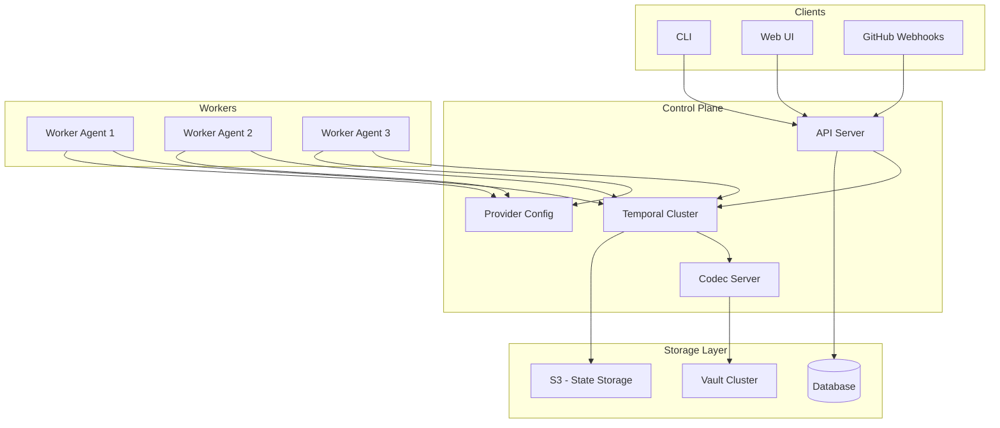
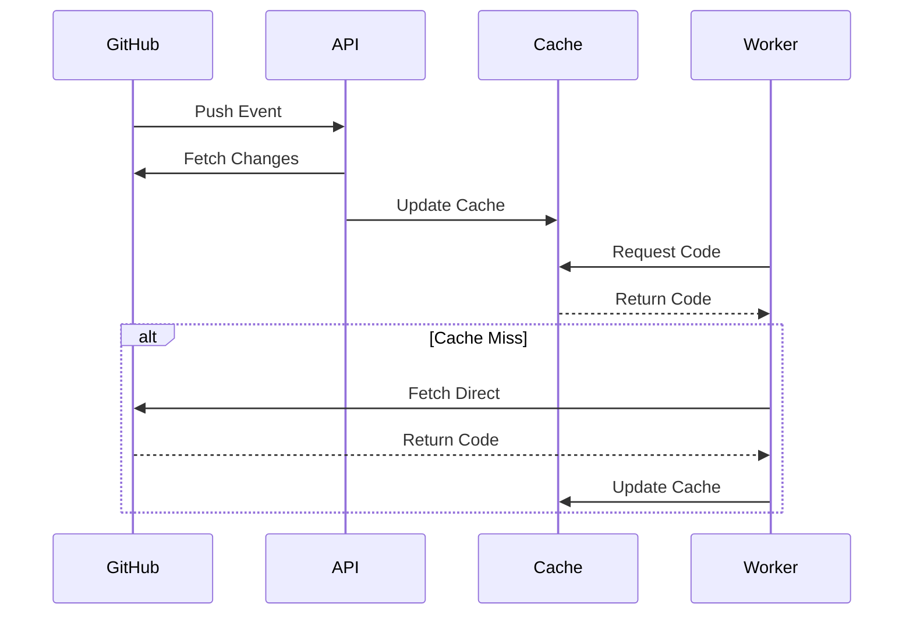
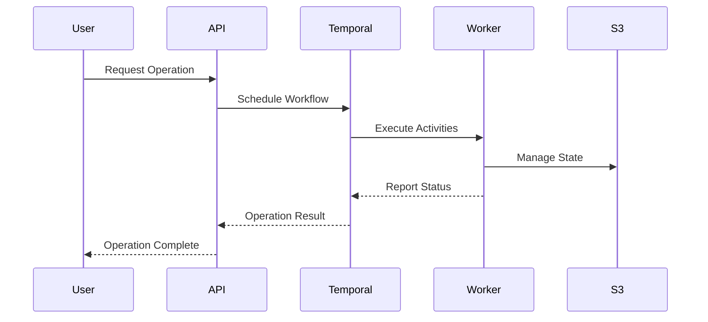
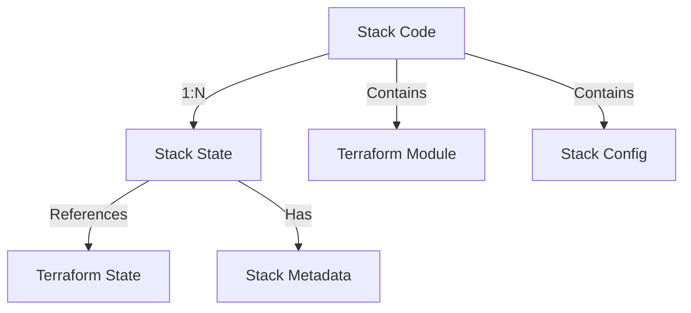
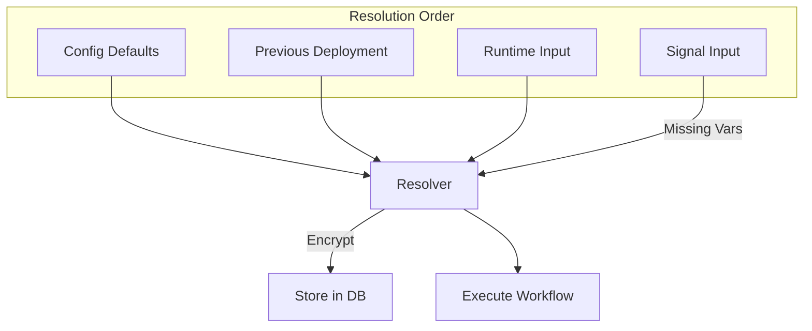
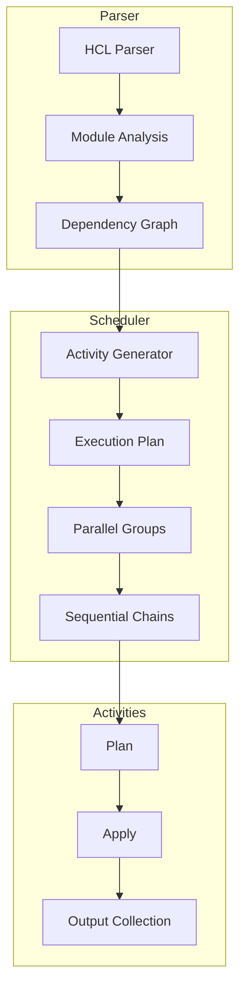
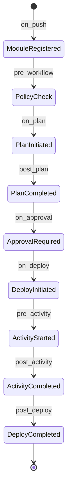
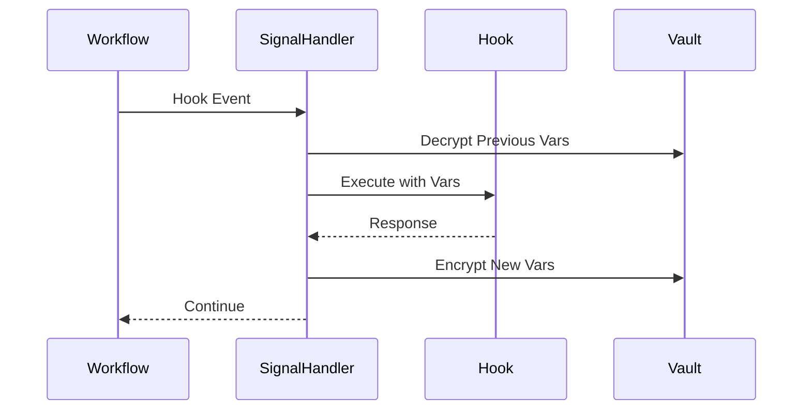
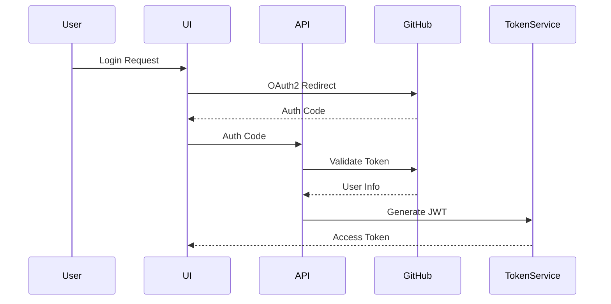
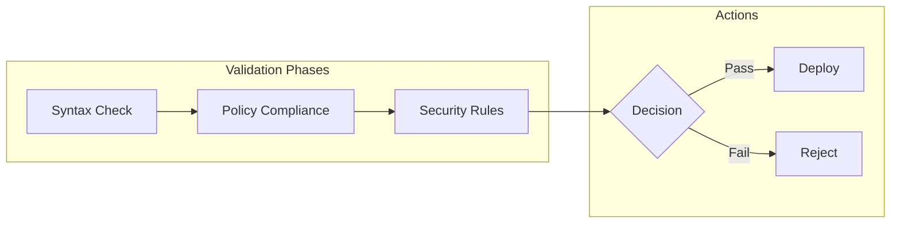

# Stackly System Design

## 1. System Overview

### Architecture Components


### Core Flows

#### GitHub Integration Flow


#### Stack Operation Flow


## 2. Core Components

### API Server

#### Services
- Stack Management (gRPC)
- Worker Registration
- Policy Enforcement
- Provider Configuration CRUD
- GitHub Webhook Handler

#### Provider Configuration
- Configuration validation
- Secure credential storage
- Environment variable mapping
- Provider alias management

### Control Plane

#### Temporal Workflow Engine
- Namespace isolation per account
- Multi-tenancy support
- Worker task routing
- Workflow scheduling

#### Worker Management
```go
type WorkerCapabilities struct {
    Features    []string           // e.g. "terraform", "ansible"
    Labels      map[string]string  // e.g. "environment": "prod"
    Resources   ResourceLimits     // CPU/memory constraints
    Version     string            // Worker version
}
```

#### Codec Server
- Workflow log encryption
- Vault Transit integration
- Key version management

## 3. Stack Model

### Stack Definition


### Configuration Schema
```hcl
stack "example" {
  # Stable identifier across repository moves
  name = "network-prod"
  description = "Production network infrastructure"
  
  # Optional path override if different from config location
  source = "./modules/network"
  
  # Pre-configured backend reference
  backend = "prod-state"
  
  # Provider configurations
  providers = {
    aws = ["prod_account", "monitoring_account"]
    gcp = ["default"]
  }
  
  # Stack dependencies (not module dependencies)
  depends_on = ["shared-vpc", "security-groups"]
  
  # Execution policies
  policies = [
    "deployment_window",
    "production_approval"
  ]
  
  # Signal-based hooks
  hooks {
    pre_plan = ["validate_quotas"]
    post_plan = ["cost_check"]
    pre_apply = ["backup_state"]
    post_apply = ["notify_slack"]
    pre_destroy = ["backup_state"]
    post_destroy = ["cleanup_monitoring"]
  }
  
  # Workflow configuration
  workflow {
    timeout = "2h"
    retries = 3
    retry_interval = "5m"
  }
}
```

### Variable Management


## 4. Workflow Engine

### TerraformDSLWorkflow

#### Components


#### Activity Management
```go
type Activity struct {
    Name string
    Type string         // "module", "resource", etc.
    Path string         // Module path
    DependsOn []string
    Inputs map[string]interface{}
    Outputs []string
    ExecutionMode string // "sequential", "parallel"
}
```

### Event System

#### Event Flow


### Hook System


## 5. Security Model

### Authentication & Authorization


### Secret Management
- Variable encryption with Vault Transit
- Provider credential isolation
- Key rotation policies
- Secure hook variable sharing

### Worker Security
- Dynamic mTLS certificates
- Namespace isolation
- Capability verification
- Environment separation

### State Security
- Encrypted S3 backend
- Access control via backend configs
- State locking mechanism
- Version control

## 6. Implementation Details

### Database Schema
```sql
-- Stack registration
CREATE TABLE stacks (
    id UUID PRIMARY KEY,
    name TEXT UNIQUE NOT NULL,
    description TEXT,
    repo_url TEXT NOT NULL,
    repo_path TEXT NOT NULL,
    current_commit VARCHAR(40) NOT NULL,
    config JSONB NOT NULL,
    status TEXT NOT NULL,
    created_at TIMESTAMPTZ NOT NULL DEFAULT NOW(),
    updated_at TIMESTAMPTZ NOT NULL DEFAULT NOW()
);

-- Stack deployments
CREATE TABLE stack_deployments (
    id UUID PRIMARY KEY,
    stack_id UUID REFERENCES stacks(id),
    commit_hash VARCHAR(40) NOT NULL,
    tf_state_key TEXT NOT NULL,
    encrypted_vars BYTEA NOT NULL,
    status TEXT NOT NULL,
    created_at TIMESTAMPTZ NOT NULL DEFAULT NOW(),
    updated_at TIMESTAMPTZ NOT NULL DEFAULT NOW()
);

-- Provider configurations
CREATE TABLE provider_configs (
    id UUID PRIMARY KEY,
    name TEXT UNIQUE NOT NULL,
    provider TEXT NOT NULL,
    config JSONB NOT NULL,
    created_at TIMESTAMPTZ NOT NULL DEFAULT NOW(),
    updated_at TIMESTAMPTZ NOT NULL DEFAULT NOW()
);

-- Operation history
CREATE TABLE operations (
    id UUID PRIMARY KEY,
    deployment_id UUID REFERENCES stack_deployments(id),
    type TEXT NOT NULL,
    status TEXT NOT NULL,
    started_at TIMESTAMPTZ NOT NULL,
    completed_at TIMESTAMPTZ,
    error_details JSONB,
    metadata JSONB
);

-- Git cache
CREATE TABLE git_cache (
    repo_url TEXT NOT NULL,
    commit_hash VARCHAR(40) NOT NULL,
    path TEXT NOT NULL,
    content BYTEA NOT NULL,
    cached_at TIMESTAMPTZ NOT NULL DEFAULT NOW(),
    PRIMARY KEY (repo_url, commit_hash, path)
);
```

### Validation Rules

